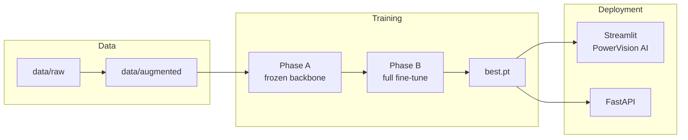
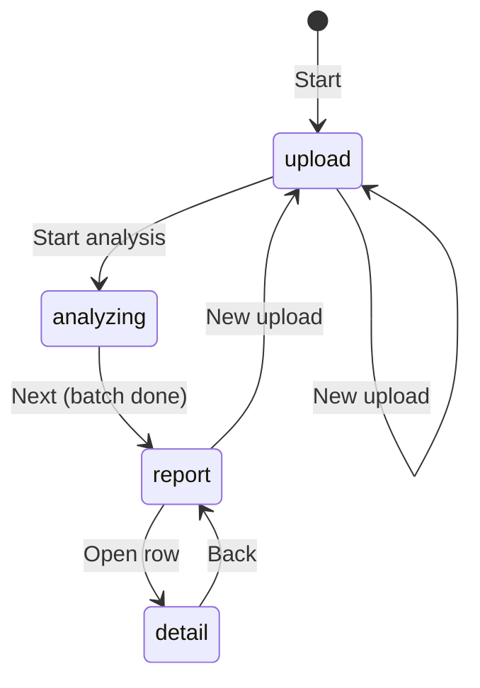

# PowerVision AI — Electromill Fault Detection (YOLO)

Industrial **object detection** for transformer terminal and cabling faults. The project prepares a **YOLO detect** dataset (axis-aligned bounding boxes), trains an **Ultralytics YOLO** model in two phases, and ships a **Streamlit inspection UI** (**PowerVision AI**) plus a **FastAPI** inference service.

Raw photos are **manually labeled**. The **first six fault types** (class IDs **0–5** in `dataset.yaml`) use **offline augmentation** when data is scarce; variants are stored on **Google Drive** and training often runs in **Google Colab**. The **last three fault types** (class IDs **6, 7, 8**) typically have enough images and are used **without script-based augmentation**, merged into the same nine-class dataset for a single training run.

---

## Table of contents

1. [Project overview](#project-overview)
2. [Repository layout](#repository-layout)
3. [Fault classes](#fault-classes-datasetyaml)
4. [Prerequisites and setup](#prerequisites-and-setup)
5. [Phase 1 — Dataset preparation](#phase-1--dataset-preparation)
6. [Phase 2 — Training and evaluation](#phase-2--training-and-evaluation)
7. [Inference — PowerVision AI (Streamlit)](#inference--powervision-ai-streamlit)
8. [Inference — FastAPI REST API](#inference--fastapi-rest-api)
9. [Configuration reference](#configuration-reference)
10. [Troubleshooting](#troubleshooting)
11. [General notes](#general-notes)

---

## Project overview

| Layer | Purpose |
|--------|---------|
| **Data** | `data/raw/` → augment (classes 0–5) → `data/augmented/`; merge classes 6–8; `dataset.yaml` defines nine classes and splits. |
| **Training** | Two-phase fine-tune: frozen backbone (Phase A) → full fine-tune (Phase B); weights under `runs/phase_b/weights/best.pt`. |
| **UI** | `api/streamlit_app.py` — multi-image upload, batch analysis, aggregate report, per-image detail with side-by-side comparison. |
| **API** | `api/main.py` — single- and multi-file prediction for integrations. |



### Dataset strategy (Drive + Colab)

| Group | Class IDs | Data volume | Augmentation | Storage / training |
|--------|-----------|-------------|--------------|---------------------|
| **First six faults** | `0`–`5` | Limited | Yes — train split expanded with Albumentations (`scripts/augment.py`); val/test copied as-is | Augmented data on **Google Drive**; **Colab** (`notebooks/Final_Faults.ipynb`) or local `train_phase_*.py` |
| **Last three faults** | `6`, `7`, `8` | Sufficient | **No** — originals as-is | Same `images/` / `labels/` tree on Drive or under `data/augmented/` |

The committed **`dataset.yaml`** defines **nine** classes (`nc: 9`) and points at the combined dataset root (typically `data/augmented`). For Colab, mount Drive and set `path` in a copy of `dataset.yaml` so `train`, `val`, and `test` resolve correctly.

**“No fault” images:** Treated as **background** (no object), not a class. Use a label file that is **empty** (same stem as the image under `labels/<split>/`).

---

## Repository layout

```text
Fault_Detection_Working/
├── dataset.yaml              # Nine classes, dataset root, train/val/test paths
├── requirements.txt          # Python dependencies (Ultralytics, Streamlit, FastAPI, …)
├── README.md                 # This file
├── configs/
│   └── yolo26s_finetune.yaml # Hyperparameter overrides for Phase A/B
├── data/                     # Gitignored — not in repo
│   ├── raw/                  # Manual labels + camera images
│   └── augmented/            # Phase 1 output + merged class 6–8 data
├── scripts/
│   ├── augment.py            # Albumentations on train split (classes 0–5 workflow)
│   ├── verify_dataset.py     # Layout and label checks → verification_report.json
│   ├── preview_augmentation.py
│   ├── bootstrap_raw_labels.py  # Empty .txt placeholders per raw image
│   ├── train_phase_a.py      # Frozen backbone (~20 epochs)
│   ├── train_phase_b.py      # Full fine-tune (up to 100 epochs, early stop)
│   ├── monitor_training.py   # Live plots from results.csv
│   └── validate_model.py     # Test/val metrics → runs/evaluation/
├── runs/                     # Gitignored — training outputs
│   ├── phase_a/
│   ├── phase_b/weights/best.pt   # Default weights for inference
│   └── evaluation/
├── api/
│   ├── streamlit_app.py      # PowerVision AI UI
│   ├── main.py               # FastAPI server
│   └── ideal_images.yaml     # Reference “ideal” images per fault group
├── notebooks/
│   └── Final_Faults.ipynb    # Colab-oriented training workflow
├── uploads/                  # Gitignored — API upload staging
└── outputs/                  # Gitignored — API annotated outputs (single predict)
```

Large folders (`data/`, `runs/`, `uploads/`, `outputs/`, `*.pt`) are listed in `.gitignore`. Obtain weights and data locally, from Drive, or after training.

---

## Fault classes (`dataset.yaml`)

| ID | Name | Notes |
|----|------|--------|
| 0 | `input_cable_fault` | First-six group; often augmented when scarce. |
| 1 | `loose_connection` | Same. |
| 2 | `output_cable_fault` | Same. |
| 3 | `ri_cable_mismatch` | Same. |
| 4 | `screw_faults` | Same. |
| 5 | `signal_cable_mismatch` | Same. |
| 6 | `J14_cable_mismatch` | Enough data — usually **no** Albumentations pipeline. |
| 7 | `red_white_mismatch` | Same. |
| 8 | `ferrule_mismatch` | Same. |

**Examples (early classes):**

- **0 — `input_cable_fault`:** Input cable phase order reversed (e.g. 8→9→10).
- **1 — `loose_connection`:** e.g. blue wire at top-left input terminal unseated.
- **2 — `output_cable_fault`:** Black/white output cables mismatched at output terminal.
- **3 — `ri_cable_mismatch`:** R/I cable mismatch.
- **4 — `screw_faults`:** e.g. one input terminal screw with wrong thread count.
- **5 — `signal_cable_mismatch`:** Signal cable mismatch.

Classes **6–8** use the same YOLO label format (`class_id cx cy w h`, normalized to `[0, 1]`).

---

## Prerequisites and setup

- **Python 3.10+** recommended.
- **`data/augmented/`** and **`data/raw/`** are not in git — build locally or download from shared storage (e.g. Google Drive).
- **GPU** strongly recommended for training; CPU works but is slow.
- **Inference:** `runs/phase_b/weights/best.pt` after Phase B (or override via `api/ideal_images.yaml` → `weights`).

From the **project root**:

```bash
pip install -r requirements.txt
```

**Ultralytics version:** YOLO11 checkpoints require **Ultralytics ≥ 8.3** (see `requirements.txt`). If loading `best.pt` fails with `C3k2` / attribute errors:

```bash
pip install -U "ultralytics>=8.3.100"
```

---

## Phase 1 — Dataset preparation

### Raw layout (manual labeling)

```text
data/raw/
  Images/
    train/
    val/
    test/
  labels/
    train/
    val/
    test/
```

Each non-empty label line: `class_id cx cy w h` with values normalized to `[0, 1]`.

Optional: create empty label placeholders before labeling:

```bash
python scripts/bootstrap_raw_labels.py
```

### Build augmented dataset (not in git)

1. **Local:** Fill `data/raw/`, then run augmentation (especially for classes **0–5**). Merge **un-augmented** images/labels for classes **6–8** into the same split folders.
2. **Download:** Extract a shared zip at project root so paths match `dataset.yaml`.

**Collaborator download link (placeholder):** *`https://YOUR_LINK_TO_ZIP_OR_FOLDER_HERE`*

### Phase 1 scripts (from project root)

```bash
python scripts/augment.py
python scripts/verify_dataset.py
python scripts/preview_augmentation.py
```

| Script | Role |
|--------|------|
| **`augment.py`** | Augments **train** only (`--aug-per-image K`); copies val/test; writes PNG + `.txt` under `data/augmented/`; aligns `dataset.yaml` with `path: data/augmented`. |
| **`verify_dataset.py`** | Layout, 1:1 image/label pairing, numeric ranges; writes `verification_report.json`, prints PASS/FAIL. |
| **`preview_augmentation.py`** | Sample raw image + one aug pass with boxes → `preview_augmentation.png`. |

### Layout after merge

```text
data/augmented/
  images/
    train/
    val/
    test/
  labels/
    train/
    val/
    test/
```

`dataset.yaml` points `train`, `val`, `test` at `images/<split>`; labels live in parallel `labels/<split>/` with matching stems.

---

## Phase 2 — Training and evaluation

Phase 2 trains a **YOLO detect** model on the combined nine-class dataset (locally or in Colab).

### Files

| Path | Role |
|------|------|
| `configs/yolo26s_finetune.yaml` | MuSGD, cosine LR, light aug, `dfl: 0.0`, `task: detect` |
| `scripts/train_phase_a.py` | Freeze backbone (10 layers), train head ~20 epochs from **`yolo11m.pt`** |
| `scripts/train_phase_b.py` | Unfreeze all, fine-tune up to 100 epochs with early stopping |
| `scripts/monitor_training.py` | Live plots from `results.csv` |
| `scripts/validate_model.py` | Evaluation pack under `runs/evaluation/` |

### Execution order (local)

```bash
python scripts/train_phase_a.py
python scripts/train_phase_a.py --dry-run   # optional sanity check
```

Optional monitor (second terminal):

```bash
python scripts/monitor_training.py
```

Phase B (requires `runs/phase_a/weights/best.pt`):

```bash
python scripts/train_phase_b.py
python scripts/validate_model.py --split test
```

Overrides:

```bash
python scripts/train_phase_b.py --phase-a-weights runs/phase_a/weights/best.pt
python scripts/validate_model.py --weights runs/phase_b/weights/best.pt --split val
```

### Why two-phase training?

On a **small or imbalanced** industrial dataset, training all layers from scratch often **overfits** or erases useful pretrained backbone features. **Phase A** freezes most of the network and adapts the detection head. **Phase B** unfreezes with a **lower** learning rate so the backbone refines without destroying the head.

### Evaluation (`runs/evaluation/`)

| Artifact | Meaning |
|----------|---------|
| `confusion_matrix.png` | Rows = ground truth, columns = prediction |
| `per_class_metrics.csv` | Precision, recall, mAP@0.5, mAP@0.5:0.95 per class |
| `per_class_metrics.png` | Bar chart of precision, recall, mAP50 |
| `evaluation_report.json` | Overall mAP, per-class APs, timing, **verdict** |

**Verdict (`validate_model.py`):**

- **PASS** — every class mAP50 ≥ 0.70  
- **WARN** — all ≥ 0.60 but some &lt; 0.70  
- **FAIL** — any class mAP50 &lt; 0.60  

### GPU memory (guidance)

| Batch | Phase | Approx. VRAM |
|-------|--------|----------------|
| 16 | Phase A | ~6 GB |
| 8 | Phase B | ~4 GB |
| 4 | Fallback | ~3 GB |

Lower `batch` in the training scripts if you hit OOM.

### Resuming after interruption

Ultralytics can resume with `last.pt` in the same run directory. If `runs/phase_a/weights/best.pt` already exists, `train_phase_a.py` may offer to skip training and refresh metrics only.

---

## Inference — PowerVision AI (Streamlit)

**App:** `api/streamlit_app.py`  
**Brand:** PowerVision AI Inspection System — multi-upload workflow, live analysis log, combined report, and per-image inspection detail.

### Run

From project root (with `runs/phase_b/weights/best.pt` present, or set `weights` in `api/ideal_images.yaml`):

```bash
streamlit run api/streamlit_app.py
```

Default URL: `http://localhost:8501`

Use the sidebar **Reset workflow** to clear uploads, results, and temp files. If the theme looks dark, use **☰ → Settings → Theme → Light** to match the app’s light styling.

### UI workflow



| Phase | What the user sees |
|--------|---------------------|
| **upload** | Multi-file uploader (up to **10** files, **10 MB** each; JPEG, PNG, TIFF, WebP, BMP). Thumbnail grid and file metadata. |
| **analyzing** | Modal dialog with progress bar and timestamped log; processes one image per rerun; **Abort analysis** supported. |
| **report** | **Detailed findings** — one card per image: index, thumbnail, filename, fault type line, description, status pill (**Fault detected** / **Clear**), **Open** button. Summary pills: total images, fault count, clear count. |
| **detail** | **Inspection detail** for one image: **Analyzed · model overlay** and **Ideal · reference** shown **side by side** in equal-sized frames (720×480 cover crop). Below: fault alert + confidence, fault type, **Description**, and **Analysis metadata** (filename, timestamp, fault type). |

### Inference behavior (UI)

- Model loaded once via `@st.cache_resource` from `runs/phase_b/weights/best.pt` (or YAML override).
- Per image: `model.predict(imgsz=640, conf=0.25, iou=0.5, max_det=20)`.
- **Fault:** highest-confidence box drives class, human-readable **fault label**, and **description** (`_fault_label_and_crisp`).
- Annotated overlay saved to a temp workdir (`*_annotated.jpg` via `result.plot()`).
- **Clear:** no boxes above confidence threshold; raw upload shown in report thumbnail.
- **Ideal reference:** resolved from `api/ideal_images.yaml` by class ID (see below); shown in detail view when the file exists.

### Ideal image mapping (`api/ideal_images.yaml`)

| YAML key | Class IDs | Purpose |
|----------|-----------|---------|
| `group_01245` | `0`, `1`, `2`, `4`, `5` | One shared reference image |
| `class_3` | `3` | Dedicated reference |
| `class_6` | `6` | Dedicated reference |
| `class_7` | `7` | Dedicated reference |
| `class_8` | `8` | Dedicated reference |

Optional environment variable: `FAULT_IDEAL_YAML` → path to an alternate YAML file.

**Windows paths in YAML:** Do **not** wrap `C:\...` in **double** quotes (backslash escapes). Use **single quotes** or **forward slashes**:

```yaml
ideal_images:
  group_01245: 'C:/path/to/ideal.jpg'
```

---

## Inference — FastAPI REST API

**App:** `api/main.py`  
**Default weights:** `runs/phase_b/weights/best.pt` (loaded at startup).

### Run

```bash
python api/main.py
```

Or:

```bash
uvicorn api.main:app --host 127.0.0.1 --port 8000
```

### Endpoints

| Method | Path | Description |
|--------|------|-------------|
| `GET` | `/health` | `{"status": "ok", "weights": "<path>"}` |
| `POST` | `/predict` | Single image upload; runs inference with `save=True`; annotated image under `outputs/predictions/` |
| `POST` | `/predict_batch` | Multiple files; JSON per file (no image bytes in response) |

### Shared predict settings

- `imgsz=640`
- `conf=0.25`
- `iou=0.5`
- `max_det=20`

### `POST /predict` response (shape)

```json
{
  "message": "Prediction successful",
  "detections": [
    {
      "class_id": 0,
      "class_name": "input_cable_fault",
      "confidence": 0.73,
      "bbox": [x1, y1, x2, y2]
    }
  ]
}
```

Uploads are stored under `uploads/` using a sanitized version of the client filename so Ultralytics output names stay predictable.

### `POST /predict_batch` response (shape)

```json
{
  "message": "Prediction successful",
  "results": [
    {
      "filename": "image_b0.jpg",
      "original_filename": "image.jpg",
      "has_fault": true,
      "detections": [ ... ],
      "primary": { "class_id": 0, "class_name": "...", "confidence": 0.73, "bbox": [...] }
    }
  ]
}
```

`primary` is the highest-confidence detection per file, or omitted when there are no detections.

---

## Configuration reference

| Item | Location / default |
|------|---------------------|
| Dataset classes & paths | `dataset.yaml` |
| Training hyperparameters | `configs/yolo26s_finetune.yaml` |
| Ideal images & optional weights override | `api/ideal_images.yaml` |
| Ideal YAML path override | Env `FAULT_IDEAL_YAML` |
| Phase B weights (inference) | `runs/phase_b/weights/best.pt` |
| Streamlit confidence / IoU | `CONF=0.25`, `IOU=0.5` in `api/streamlit_app.py` |
| Detail compare frame size | `_DETAIL_COMPARE_W=720`, `_DETAIL_COMPARE_H=480` in `api/streamlit_app.py` |

---

## Troubleshooting

| Issue | What to try |
|--------|-------------|
| `C3k2` / can't get attribute when loading `best.pt` | Upgrade Ultralytics: `pip install -U "ultralytics>=8.3.100"` |
| Streamlit dialog error | Requires Streamlit ≥ 1.36: `pip install -U "streamlit>=1.36"` |
| Missing weights at startup (API/UI) | Run Phase B training or set `weights:` in `ideal_images.yaml` |
| Ideal image missing in detail view | Fix paths in `ideal_images.yaml`; check class ID → key mapping |
| YAML path errors on Windows | Single-quoted or forward-slash paths (see above) |
| Class mAP50 &lt; 0.6 | More real images, label audit, tuned augmentation for 0–5 |

---

## General notes

- Run scripts as `python scripts/<script>.py` from the **project root** so relative paths resolve.
- Missing label file → image skipped with warning (verify script). Empty label file → background sample.
- Augmentation uses Albumentations bbox transforms; labels are **transformed** boxes, not guessed.
- The Streamlit app writes uploads to a **temp directory** per batch and deletes it on reset or new upload.
- FastAPI single-file predict saves annotated outputs under `outputs/predictions/`; batch predict does not save images (`save=False`).

---

## Quick start (inference only)

If you already have `runs/phase_b/weights/best.pt` and `api/ideal_images.yaml` configured:

```bash
pip install -r requirements.txt
streamlit run api/streamlit_app.py
```

For programmatic access:

```bash
python api/main.py
curl http://127.0.0.1:8000/health
```
